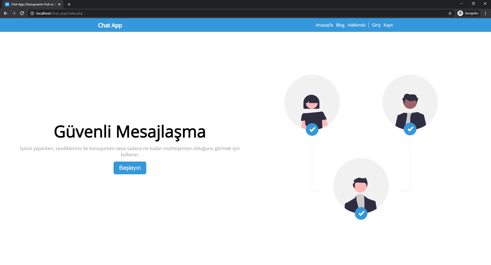

# Chat App



Basit, hızlı ve güvenli bir mesajlaşma uygulaması mı dediniz? Bu kesinlikle öyle bir şey değil 😂

PHP ve MySQL ile yazılmış basit bir web tabanlı mesajlaşma uygulaması. Mesajlar şifreli değil (çünkü daha sonra nasıl çözeceğimi bilmiyorum) ve hesaplar stabil değil.

Peki neden mi? Pratik...

Eğer kontrol etmek istersen,

```
localhost/phpmyadmin
```

üzerinde kendine `chat_app` adında bir veritabanı oluşturmalısın.
